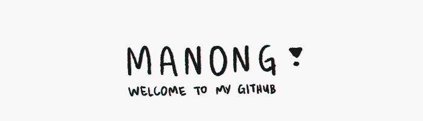
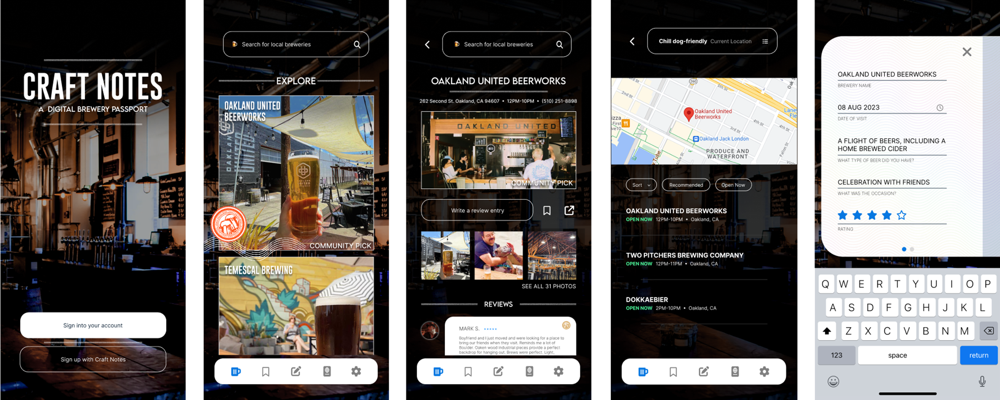

# 𝐀 𝐍𝐄𝐖 𝐆𝐈𝐓𝐇𝐔𝐁 𝐔𝐒𝐄𝐑 𝐀𝐏𝐏𝐑𝐎𝐀𝐂𝐇𝐄𝐒
Hello! My name is **Manong Chris** (they/he) and I'm a UI/UX designer, front-end web developer, digital illustrator, and asset designer! I bring a unique mix of skills to any project or team — everything in-between my background in Operations and Data Management to my training in anthropology and archivist scholar methodologies. I'm interested in user experience, user research, and product design!

-	:potted_plant: **Improving** on Figma, Three.js, and Blender.
-	:mushroom: **Portfolio** soon forthcoming!
- :herb: **Glance** at my [writing samples](https://gist.github.com/christiangella) about code.
- :flags: **Fun-fact**: I co-founded a Middle School!
- :sparkles: **Connect** with me on [LinkedIn](https://www.linkedin.com/in/christian-gella-293539a5/) or by [email](mailto:christian.gella@gmail.com).

## 𝐔𝐈/𝐔𝐗 𝐏𝐑𝐎𝐃𝐔𝐂𝐓𝐒

## 𝐅𝐔𝐋𝐋 𝐒𝐓𝐀𝐂𝐊 𝐏𝐑𝐎𝐃𝐔𝐂𝐓𝐒

## 𝐓𝐄𝐂𝐇 𝐒𝐓𝐀𝐂𝐊

